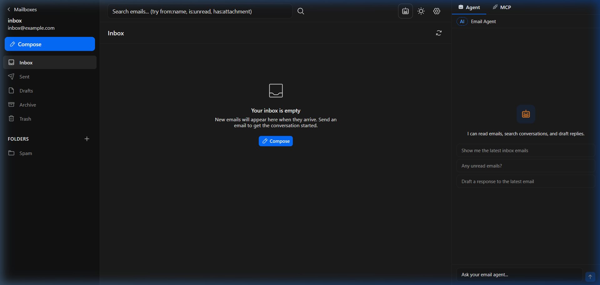

# 🛡️ Agentic Inbox (Customized for Cloudflare Free Tier)

*Forked from the original Cloudflare project: [cloudflare/agentic-inbox](https://github.com/cloudflare/agentic-inbox)*

**Agentic Inbox** is a modern, self-hosted email client and AI agent suite built entirely on the Cloudflare developer platform. It combines a responsive web UI with a powerful AI agent that can manage your inbox, draft replies, and even be controlled via external tools using the **Model Context Protocol (MCP)**.

<div style="display: flex; gap: 10px; margin-bottom: 20px;">
  
  
</div>

## ✨ Key Features

*   **🔄 Unified Catch-All Architecture**: Manage infinite email aliases (e.g., `work@yourdomain.com`, `billing@yourdomain.com`) from a single, centralized inbox.
*   **🤖 Integrated AI Agent**: Built-in chat interface using `@cloudflare/ai-chat` (Kimi K2.5) that understands your inbox context. It can search emails, summarize threads, and draft replies.
*   **🔌 MCP Server (Model Context Protocol)**: Exposes a standardized interface for external AI agents (like Claude or Cursor) to interact with your inbox securely.
*   **📢 Real-time Notifications**: Instant alerts for incoming emails delivered via **Discord Webhooks**.
*   **📧 SMTP2GO Integration**: Reliable outbound email delivery bypassing Cloudflare Free Tier limitations.
*   **📱 Modern Split-View UI**: A responsive React Router v7 application with thread support, rich text editing (Tiptap), and a sleek bluish-gray dark theme.
*   **📁 Smart Folder Management**: Support for Inbox, Sent, Drafts, Archive, and Trash, plus custom folder creation and deletion.

## 📥 The Unified Inbox: Sending & Receiving

This project uses a "Catch-All" philosophy to simplify your email life while maintaining a professional appearance.

### **Receive Anything**
You don't need to create separate mailboxes for every alias. Once Cloudflare Email Routing is set up, **every email** sent to `@yourdomain.com` is captured and routed to this single app. The UI clearly shows which specific alias (e.g., `support@`) received the mail.

### **Send from Any Alias**
You have total flexibility when replying or composing:
- **Smart Reply**: When you hit reply, the app automatically detects which of your aliases received the original email and sets it as the "From" address for your response.
- **Custom From**: When composing a new email, you can manually type in *any* alias (e.g., `newsletter@yourdomain.com`), and it will be sent out perfectly from that address.

---

## 🏗️ Architecture

*   **Backend**: Hono on Cloudflare Workers.
*   **Frontend**: React Router v7 (SPA) with TanStack Query.
*   **Database**: Durable Objects (SQLite-backed) for email metadata and agent state.
*   **Storage**: Cloudflare R2 for settings and large attachments.
*   **AI**: Cloudflare Workers AI for agent reasoning and drafting.

## 🚀 Setup & Deployment

### 1. Prerequisites
- A Cloudflare account with a domain.
- An [SMTP2GO](https://www.smtp2go.com/) account (Free tier works great).
- (Optional) A Discord Webhook URL for notifications.

### 2. Configuration
Update `wrangler.jsonc` with your catch-all mailbox:

```jsonc
"vars": {
    "DEFAULT_MAILBOX": "hello@yourdomain.com",
    "DISCORD_WEBHOOK_URL": "...", // Optional
}
```

### 3. Secrets
Set the required secrets for production:
```bash
# SMTP for outgoing mail
wrangler secret put SMTP2GO_API_KEY

# Cloudflare Access (for authentication)
wrangler secret put POLICY_AUD
wrangler secret put TEAM_DOMAIN
```

### 4. Storage Setup
Create the R2 bucket for attachments:
```bash
wrangler r2 bucket create agentic-inbox
```

### 5. Deployment
```bash
npm install
npm run build
npm run deploy
```

## 🛠️ MCP Usage
You can connect this inbox to external tools (like Cursor or Claude Code) by pointing them to your worker's MCP endpoint:
`https://inbox-on-cloudflare.your-subdomain.workers.dev/mcp`
